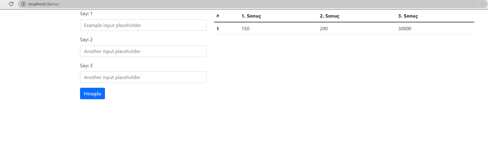

## JS hesap makinası

Basit bir kod yapısı istiyorum ben işin içinden çıkamadım. 
çarpma işlemi gibi olacak ama küsüratlı. 
kullanıcı formda 3 farklı textbox'a rakam girecek hesapla butonuna tıklanınca 3 farklı title verecek
### 1. sonuç = textbox 1 x textbox 2
### 2. sonuç = textbox 1 x textbox 3
### 3. sonuç = 2. sonuç x 1. sonuç
php alt tabanlı bi yazılıma entegresini yapacağım yazacağınız kod php veya js olabilir basit bir form istiyorum yapabilecekler özel mesaj atabilir. 

## Projeden Kesit.

## License

[MIT](https://choosealicense.com/licenses/mit/)